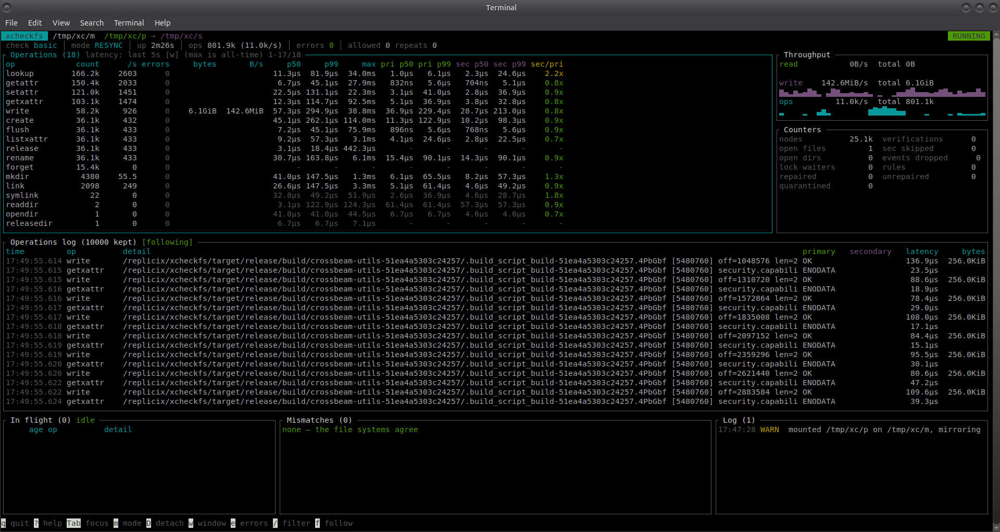

# xcheckfs


xcheckfs (cross-check FS) is a FUSE file system that validates an *experimental* file system
against a trusted, battle-tested one. `xcheckfs mount /mnt /home /experimental`
mounts `/home` at `/mnt` and mirrors every operation to `/experimental` in
lockstep, compares the outcomes, and reports every disagreement. Both
directories can live on any POSIX-compatible file system: native, FUSE,
network.

## Why

Testing a new file system with synthetic workloads misses what real
applications do. xcheckfs lets you test on live data without risk to the
workload: the **primary** (trusted) file system is authoritative, and
applications always get the primary's results. The **secondary** (the
experimental one) only receives a copy of every operation, and whatever it
does differently is a finding, not an outage.

## Install

xcheckfs runs on Linux (x86_64 and aarch64). Each
[release](https://github.com/replicix/xcheckfs/releases) has a static binary
that runs on any distribution, plus `.deb` and `.rpm` packages. Mounting as a
non-root user also needs `fusermount3` (package `fuse3`; the packages depend
on it).

```bash
# static binary, to /usr/local/bin (root) or ~/.local/bin
curl -fsSL https://github.com/replicix/xcheckfs/releases/latest/download/install.sh | sh

# or a package, e.g. on Debian/Ubuntu or Fedora/RHEL
sudo apt install ./xcheckfs_*_amd64.deb
sudo dnf install ./xcheckfs-*.x86_64.rpm

# or from source (Rust 1.88 or newer)
cargo build --release            # binary: target/release/xcheckfs
```

While the repository is private, download with an authenticated GitHub CLI:
`gh release download -R replicix/xcheckfs -p install.sh -O - | sh` (the
script then uses `gh` too).

## Quick start

```bash
# 1. Make both trees identical, and prove it.
rsync -aHAX --numeric-ids /home/ /experimental/
xcheckfs verify /home /experimental

# 2. Mount over the primary itself (as root), so nothing can bypass the mirror.
#    --quarantine keeps the secondary's version of every object that is
#    repaired (the directory must be outside both trees).
sudo xcheckfs mount --ui tui --quarantine /var/tmp/xcheckfs-quarantine /home /home /experimental

# ... or mount at a separate mount point and use only that.
xcheckfs mount --ui tui --quarantine /var/tmp/xcheckfs-quarantine /mnt /home /experimental
```

`xcheckfs` sits in the data path of the primary: take a snapshot or backup
first, and read [Limitations](docs/reference/limitations.md). For the full
procedure see [Test an experimental file system](docs/how-to-guides/test-an-experimental-fs.md);
for a risk-free 10-minute try-out with scratch directories see
[First session](docs/tutorials/first-session.md).

## User interfaces



| `--ui` | What you get |
|---|---|
| `log` (default) | Colored log lines on stderr; mismatches at error level. Also the only mode for `--background` (logs go to syslog or `--log-file`). |
| `tui` | Interactive dashboard: operations log, per-operation statistics and latencies of both sides, in-flight operations, mismatches, and a modal to decide on a frozen mismatch. Press `?` for key bindings ([TUI reference](docs/reference/tui.md)). |

## Check levels

`--check` (`-c`) selects how much is verified per operation. Details:
[Checks reference](docs/reference/checks.md).

| Level | What is checked |
|---|---|
| `basic` (default) | Return codes and everything both file systems return: attributes, data, listings, link targets, xattrs. |
| `thorough` | Also reads back the effect of every mutation while still in lockstep (data after write, attributes after setattr, absence after unlink, identity after rename, ...). |
| `paranoid` | Also compares the complete file content when a written file is closed, and the complete parent listing after namespace changes. |

## Mismatch modes

`--on-mismatch` (`-m`) selects what happens when the file systems disagree.
Details: [Design](docs/explanation/DESIGN.md#mismatch-handling).

| Mode | Behavior |
|---|---|
| `resync` (default) | Report the mismatch, then repair the secondary from the primary (the primary is never modified); the application gets the primary's result. Keeps the run testing every object. See [Repair](docs/explanation/DESIGN.md#repair-resync). |
| `log` | Report the mismatch only; the application gets the primary's result and the secondary stays diverged. |
| `fail` | Return `EIO` for the operation (the primary already applied it). For CI. |
| `freeze` | Hold the operation and every new one until an operator decides: continue, allow, retry, resync, fail, or detach. |
| `detach` | Stop using the secondary; continue as a pass-through to the primary. |

Known, harmless differences are silenced with an
[allow-rules file](docs/reference/rules.md).

## Controlling a running mount

```bash
xcheckfs ctl /mnt status               # counters, mode, state (running/frozen/detached)
xcheckfs ctl /mnt mismatches 10        # the last 10 mismatches as JSON
xcheckfs ctl /mnt pending              # frozen mismatches waiting for a decision
xcheckfs ctl /mnt resolve 3 resync     # decide on mismatch #3
xcheckfs ctl /mnt mode freeze          # change the mismatch mode
```

Protocol and all commands: [Control protocol](docs/reference/control-protocol.md).
Exit codes: `mount` returns 3 if any mismatch was recorded; `verify` returns 3
on differences. See the [CLI reference](docs/reference/cli.md).

## Documentation

Everything is under [docs/](docs/README.md), organised by the
[Diátaxis](https://diataxis.fr/) method: tutorials, how-to guides, reference
and explanation.

## License

[MPL-2.0](LICENSE).
